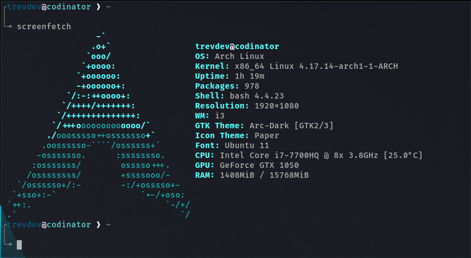

# Table of Contents

1.  [My bashrc setup.](#orgafc1e82)

# My bashrc setup.

Heavily borrowed from [Mathias Bynens](<https://github.com/mathiasbynens/dotfiles>)

Backup your bashrc related files and copy all the dotfiles from here to your home directory. You may then copy all the bash dotfiles to your home and root-home directories.

    cp .bash* ~/
    # (Repeat the same for root)

