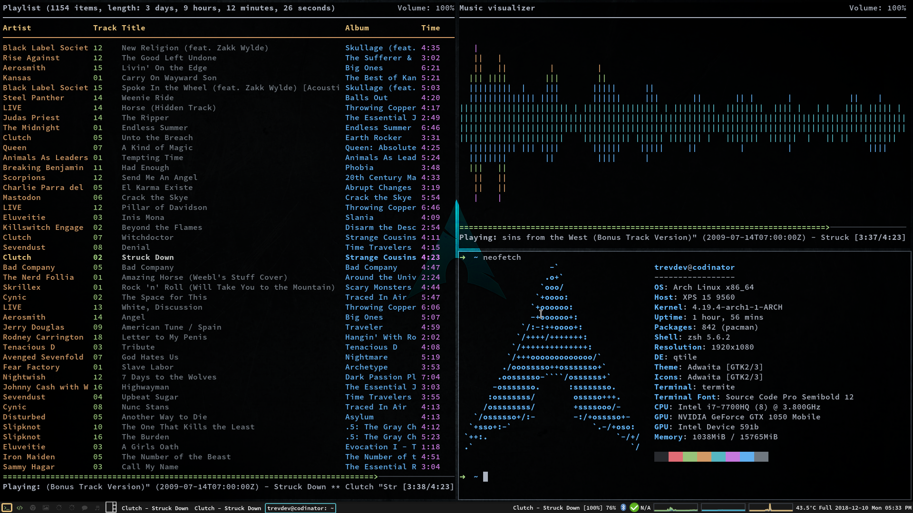
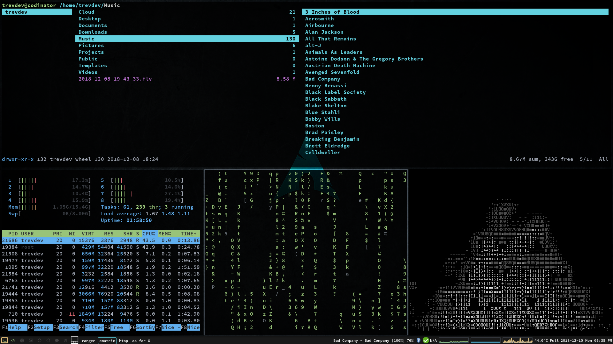
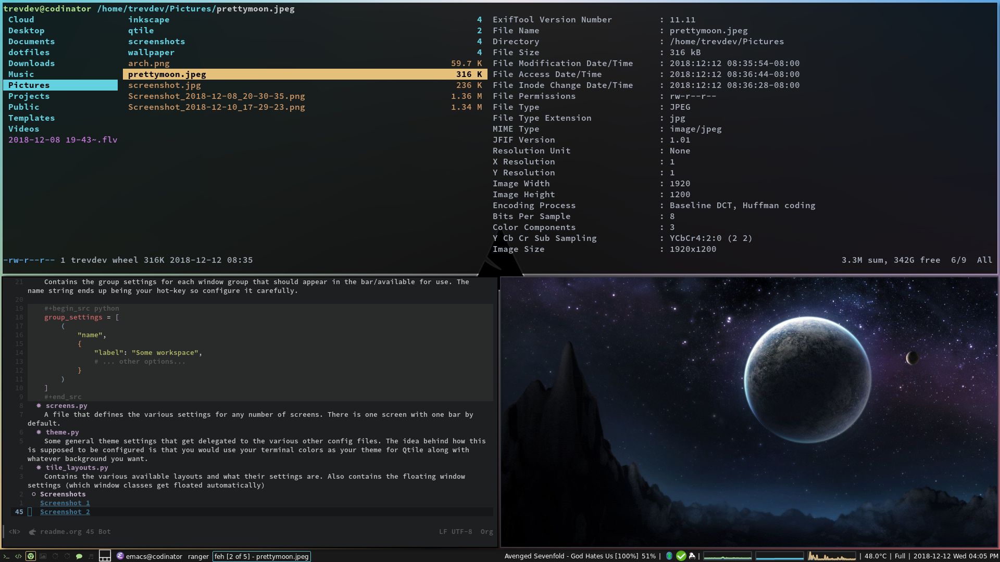
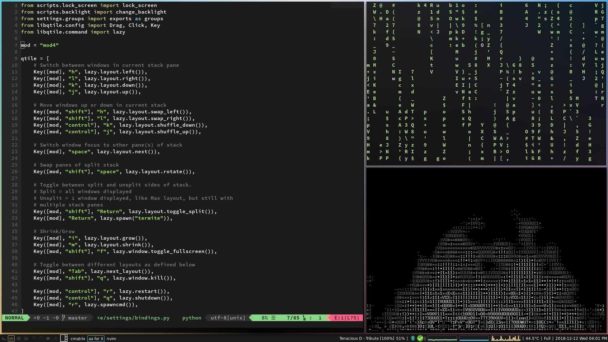

# Table of Contents

1.  [Qtile WM Config](#orge5fd7a0)
    1.  [Installation](#org100eadd)
        1.  [Dependencies](#orgcaf0d58)
        2.  [Instructions](#orgb7a28e8)
    2.  [The settings module/folder](#orgd61b39f)
        1.  [autostart.py](#org986d684)
        2.  [bars.py](#org6992b1d)
        3.  [bindings.py](#org132b28f)
        4.  [groups.py](#orga2b261d)
        5.  [screens.py](#orgf8d5200)
        6.  [theme.py](#orgcffb443)
        7.  [tile_layouts.py](#org58dd84a)
    3.  [Screenshots](#orgac810f3)
    4.  [Todos](#todos)

# Qtile WM Config

Contained in this repo are my Qtile WM configs. I don't enjoy config files more than 350 lines long, so most of my settings are imported from a 'settings' module.

## Installation

This config is setup for Arch Linux so it is easiest to deploy there.

### Dependencies

This configuration will work for you if you do not install these, but they're recommended. Without them, you will have to tweak some settings yourself.

-   [awesome-terminal-fonts](https://github.com/gabrielelana/awesome-terminal-fonts) for all of the neat little glyphs/icons.
-   feh, image viewer for the bg
-   xautolock & i3lock, scrot & imagemagick for the lock screen script
-   compton to make things look nicer

### Instructions

Make sure you install [Qtile](http://www.qtile.org) (of course). Whether you launch Qtile from your .xinit or a display manager is up to you. Either way, make sure you symlink the root folder for this config to your ~/.config/ directory. It's also worth noting that I wrote my configs with Python 3.6 or better in mind.

## The settings module/folder

I will attempt to explain what's in here and what each file does.

### autostart.py

Contains a hook function to auto-start applications on a new session using Popen.

### bars.py

Stores variables for a top/bottom/left/right bar and what widgets go inside them.

### bindings.py

Stores a number of lists that make up the \`mouse\` and \`keys\` list. These make up key/mouse bindings.

### groups.py

Contains the group settings for each window group that should appear in the bar/available for use. The name string ends up being your hot-key so configure it carefully.

    group_settings = [
        (
            "name",
            {
                "label": "Some workspace",
                # ... other options...
            }
        )
    ]

### screens.py

A file that defines the various settings for any number of screens. There is one screen with one bar by default.

### theme.py

Some general theme settings that get delegated to the various other config files. The idea behind how this is supposed to be configured is that you would use your terminal colors as your theme for Qtile along with whatever background you want.

### tile_layouts.py

Contains the various available layouts and what their settings are. Also contains the floating window settings (which window classes get floated automatically)

## Screenshots

## Todos
- [x] Figure out how to run arbitrary functions in keybindings instead of executible scripts.
- [x] Fix backlight functions
- [x] Find a sweet background to match the color scheme (ended up just making one)
- [ ] Volume control for bluetooth output does not work. It doesn't automatically switch from the soundcard when bluetooth audio is synced.